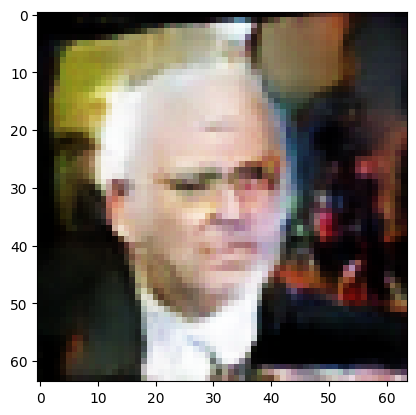
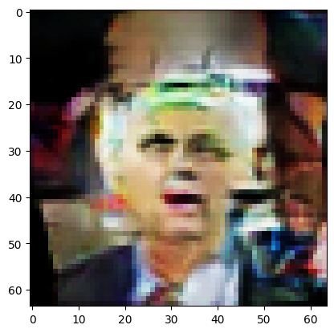
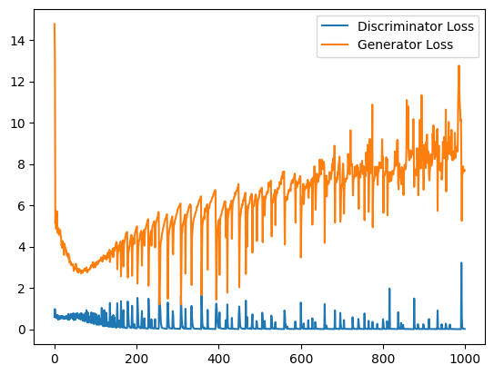

# DCGAN training for Multi-GPU from scrach using PyTorch

This project implements a model based on the paper Unsupervised Representation Learning with Deep Convolutional Generative Adversarial Networks and the original GAN paper by Ian Goodfellow et al. The code includes `torchrun` capabilities for distributed training on multi-GPU. Mutiple machines not supported. 
The aim of this project is to familiarize myself with the distributive training process that often goes hidden when learning about machine learning. Furthermore, this would develop my skill in torchrun and pytorch allowing a more fundamental understanding behind the pytorch framework. 

## Prerequisites

You can install required libraroes.

```bash
pip install -r requirements.txt
```

## Running the Code

To run the code, use the following command:

```bash
torchrun --standalone --nproc_per_node=gpu torchrun_main.py
```

## Result

After 300 epochs

 

The above are generated image from noise. It does not look satisfactory, I will attempt to implement a perceptual loss as well such that I can track best outcome while minimizing perceptual discrepency. 



Generally the discriminator learns fairly quickly, not allowing the generator to catch up resulting in the above graph. Either increasing m or descreasing k should provide a more stable outcome. Lower batch-size with lower learninig rate could also work. Finding the right hyperparameters should be done through Optuna or W&B Sweeps. 


## Hyperparameters

All hyperparameters and values must be edited directly in the code. Future updates will include a more flexible configuration system.

## References

- Unsupervised Representation Learning with Deep Convolutional Generative Adversarial Networks
- Generative Adversarial Networks by Ian Goodfellow et al.
